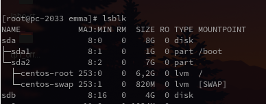
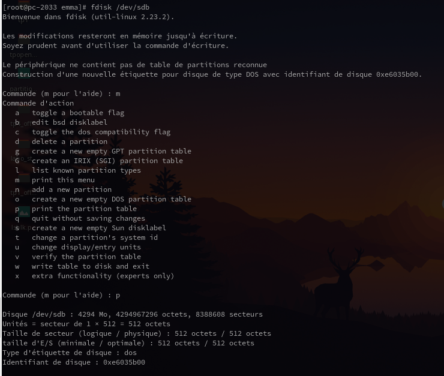
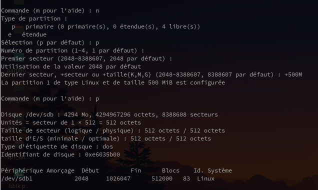
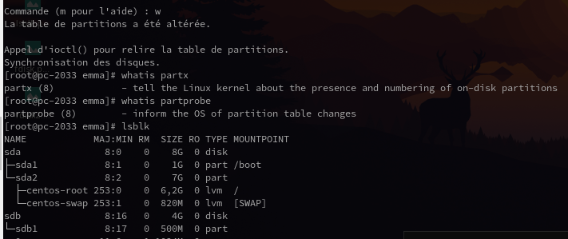
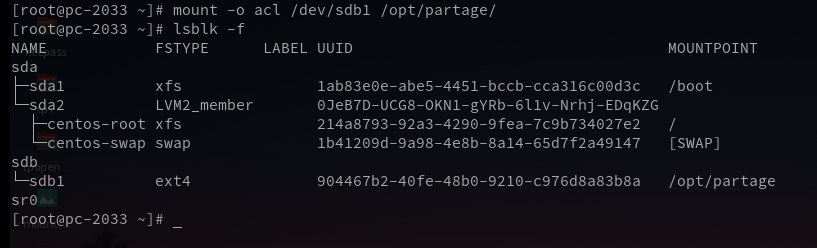
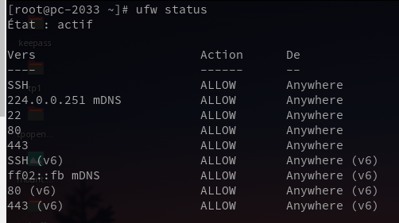

# TP1 : Sécurité des systèmes d’exploitations Linux
## Manipulation des droits d’accès au système de fichiers

## Classe : B3B
## Élèves : Emma Durand **[@emmadrd912](https://github.com/emmadrd912)** et Pierre Ceberio **[@PierreYnov](https://github.com/PierreYnov)** 


# Sommaire 

- [Le Lab](#le-lab)
- [Préparation et durcissement du système d’exploitation](##pr%C3%A9paration-et-durcissement-du-syst%C3%A8me-dexploitation)
    - [I. Installation du système d’exploitation](##i-installation-du-syst%C3%A8me-dexploitation)
    - [II. Sécurisation de l’administration du serveur](#ii-s%C3%A9curisation-de-ladministration-du-serveur)
- [Configuration et durcissement du rôle serveur de fichiers](#configuration-et-durcissement-du-r%C3%B4le-serveur-de-fichiers)
    - [I. Préparation du dossier /partage](#i-pr%C3%A9paration-du-dossier-partage)
    - [II. Préparation des comptes utilisateurs](#ii-pr%C3%A9paration-des-comptes-utilisateurs)
    - [III. Préparation de la structure des répertoires](#iii-pr%C3%A9paration-de-la-structure-des-r%C3%A9pertoires)


## Le lab

- 1 Linux Centos 7 minimal

## Préparation et durcissement du système d’exploitation

### I. Installation du système d’exploitation

On installe la version ```CentOS-7-x86_64-Minimal-2003.iso``` et pour avoir les derniers correctifs de sécurité on ``yum update`` 




On crée une nouvelle partition avec la commande ``fdisk /dev/sdb``





On voit que c'est bien créé :



On active l'option ACL en montant le dossier /partage sur la partition :  



> Le dossier partage est bien monté ! 

### II. Sécurisation de l’administration du serveur

mettre en oeuvre ces mesures : 

- administration du serv vie SSH (en suivant ces reco https://www.ssi.gouv.fr/guide/recommandations-pour-un-usage-securise-dopenssh/)
- chaque personne pourra etablir une session via son compte user et une biclef sécurisé pour acceder au systeme de fichier

- flux reseau entrant sortant doit etre filtré ( 80 443 22 avec ufw ?)

On a renforcé la sécurisation de SSH en modifiant :
- Le ```PermitRootLogin``` en ```no``` pour interdire la connexion avec le compte root
- Le ```Protocol``` de SSH, nous avons utilisé le ```2```
- Le ```Strictmode``` pour l'activer et vérifier les droits du ```.ssh/```

On met une passphrase également après avoir générer la biclef avec ``ssh-keygen`` pour chaque utilisateur.


Pour gérer le flux réseau on installe ufw et on restreint le réseau aux ports 80, 443 et 22.

    sudo ufw deny default outgoing
    sudo ufw deny default incoming
    sudo ufw allow ssh
    sudo ufw allow http
    sudo ufw allow https



## Configuration et durcissement du rôle serveur de fichiers

### I. Préparation du dossier /partage

Les dossiers partagés devront être stockés sur une partition dédiée (/partage) offrant les fonctionnalités des
ACL posix

### II. Préparation des comptes utilisateurs

créer un script shell qui :

- crée des comptes : Done
- des groupes users : Done
- un mdp robuste : Done
- passphrase pour la biclef

(liste des comptes à créer en annexe)


### III. Préparation de la structure des répertoires

créer la structure des dossiers partagés sur le serv en regardant la structure en annexe

utilisez ACL POSIX pour parametrer les permissions sur les repertoire ( en suivant la liste de controle d'accès)

voir https://www.usenix.org/legacy/publications/library/proceedings/usenix03/tech/freenix03/full_papers/gruenbacher/gruenbacher_html/

https://lea-linux.org/documentations/Gestion_des_ACL
