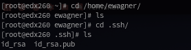
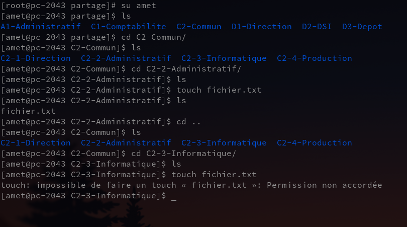

# TP1 : Sécurité des systèmes d'exploitation Linux
## Manipulation des droits d’accès au système de fichiers

## Classe : B3B
## Élèves : Emma Durand **[@emmadrd912](https://github.com/emmadrd912)** et Pierre Ceberio **[@PierreYnov](https://github.com/PierreYnov)**


# Sommaire

- [Le Lab](#le-lab)
- [Préparation et durcissement du système d’exploitation](##pr%C3%A9paration-et-durcissement-du-syst%C3%A8me-dexploitation)
    - [I. Installation du système d’exploitation](##i-installation-du-syst%C3%A8me-dexploitation)
    - [II. Sécurisation de l’administration du serveur](#ii-s%C3%A9curisation-de-ladministration-du-serveur)
- [Configuration et durcissement du rôle serveur de fichiers](#configuration-et-durcissement-du-r%C3%B4le-serveur-de-fichiers)
    - [I. Préparation du dossier /partage](#i-pr%C3%A9paration-du-dossier-partage)
    - [II. Préparation des comptes utilisateurs](#ii-pr%C3%A9paration-des-comptes-utilisateurs)
    - [III. Préparation de la structure des répertoires](#iii-pr%C3%A9paration-de-la-structure-des-r%C3%A9pertoires)


## Le lab

- 1 Linux Centos 7 minimal

## Préparation et durcissement du système d’exploitation

### I. Installation du système d’exploitation

On installe la version ```CentOS-7-x86_64-Minimal-2003.iso``` et pour avoir les derniers correctifs de sécurité on ``yum update``


On crée une nouvelle partition avec la commande ``fdisk /dev/sdb``


On voit que c'est bien créé :


On active l'option ACL en montant le dossier **/partage** sur la partition :  


Le dossier partage est bien monté !

### II. Sécurisation de l’administration du serveur

    mettre en oeuvre ces mesures :

    - administration du serveur via SSH (en suivant ces recommandations https://www.ssi.gouv.fr/guide/recommandations-pour-un-usage-securise-dopenssh/)
    - chaque personne pourra établir une session via son compte user et une biclef sécurisée pour accéder au système de fichier
    - le flux réseau entrant/sortant doit être filtré 

On a renforcé la sécurisation de SSH en modifiant :

- Le ```PermitRootLogin``` en ```no``` pour interdire la connexion avec le compte root
- Le ```Protocol``` de SSH, nous avons utilisé le ```2```
- Le ```Strictmode``` pour l'activer et vérifier les droits du ```.ssh/```

On met une ``passphrase`` également après avoir généré la biclef avec ``ssh-keygen`` pour chaque utilisateur.


Pour gérer le flux réseau on installe ``ufw`` et on restreint le réseau aux ports *80*, *443* et *22*.

    sudo ufw deny default outgoing
    sudo ufw deny default incoming
    sudo ufw allow ssh
    sudo ufw allow http
    sudo ufw allow https


## Configuration et durcissement du rôle serveur de fichiers

### I. Préparation du dossier /partage

Les dossiers partagés devront être stockés sur une partition dédiée **/partage** offrant les fonctionnalités des
ACL Posix.

### II. Préparation des comptes utilisateurs

Création d'un script ``shell`` qui contient :

- la création des comptes
- la création des groupes users
- un mot de passe robuste pour le user
- une biclef avec une passphrase robuste

**Le script se trouve [ici](https://github.com/PierreYnov/tp1_gia_droit_linux/blob/main/script.sh)**

Lorsqu'on lance le script, il nous affiche dans la console les actions qu'il a faites.


> On remarque que le script nous retourne aussi les mots de passe.
Vu que les mots de passes et passphrases sont générés aléatoirement, nous l'affichons pour garder une trace et les réutiliser lorsqu'on en aura besoin. Nous les stockons aussi dans un fichier .txt.

Nous pouvons ensuite vérifier si les comptes et les groupes ont bien été créés avec un ```cat /etc/group```.


> Les utilisateurs et les groupes ont bien été créés. On remarque aussi que les utilisateurs ont bien été affectés à leurs groupes.

Pour vérifier que les clé ssh se sont bien générées pour chaque utilisateur, il suffit de se rendre dans le dossier de l'utilisateur et vérifier si les clés sont bien présentes.



> La connexion est OK et les clés se sont bien générées.

### III. Préparation de la structure des répertoires

    - Créer la structure des dossiers partagés sur le serveur en regardant la structure en annexe.


> La structure est créée.

- Utilisez ``ACL POSIX`` pour paramétrer les permissions sur les répertoires (en suivant la liste de contrôle d'accès)

Pour les ACL, nous nous sommes référés au tableau annexe.


Puis nous avons commencé à définir les permissions sur chaque dossier :

Pour mettre en place des ACL, il suffit d'utiliser la commande :

```
setfacl -m u:ewagner:rwx,g:Direction:rwx D1-Direction/
```

> On précise l'utilisateur et les droits auquel on veut associer au dossier.

Toutes nos commandes pour la création des ACL sur chaque dossier sont présentes dans le fichier : [acl.txt](https://github.com/PierreYnov/tp1_gia_droit_linux/blob/main/acl.txt).

Une fois la mise en place des ACL des effectués, on peut vérifier que cela fonctionne.

***Exemple :***

***Ewagner*** est présent dans le groupe ***Direction*** et à comme droit de lecture et écriture sur le dossier ``D1-Direction`` :


> Il peut donc acceder au dossier et même pouvoir créer un fichier.

***Alaroche*** est présent dans le groupe ***ServiceComptabilité*** qui a le droit de lecture sur le dossier ``D1-1-Stratégie`` mais n'a pas le droit d'écriture :


> On remarque qu'on peut lire dans le dossier, mais pas écrire.

***Amet*** a les droits de lecture et d'écriture sur le dossier ``C2-2-Administratif`` mais n'a pas les droits d'écriture sur ``C2-3-Informatique`` :



> On remarque bien que amet ne peut pas créer de fichier dans ``C2-3-Informatique`` mais qu'il peut dans le dossier ``C2-2-Administratif``.

Comme vu ci-dessus, la mise en place des ACL est fonctionnelle !
